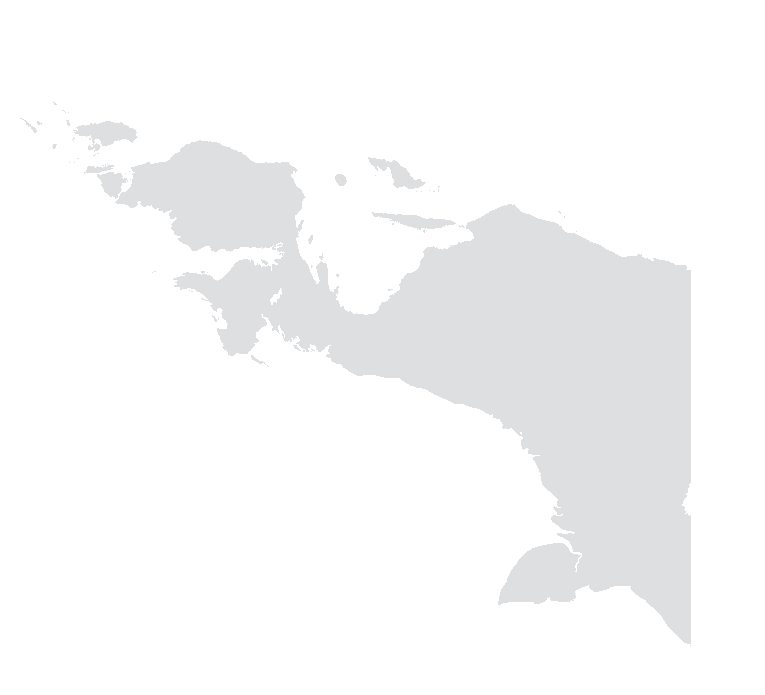

<h1 align="center">Belajar Tentang Papua</h1>

<p align="center">
  
  <br>
  <em>Menjelajahi kekayaan budaya, sejarah, dan keindahan alam Papua</em>
</p>

Situs "Belajar Tentang Papua" adalah kumpulan informasi sederhana tentang Papua yang dibuat secara kolaboratif dan bersifat open source. Proyek ini bertujuan untuk menyediakan sumber informasi yang komprehensif, akurat, dan mudah diakses tentang Papua.

[](https://belajartentangpapua.web.id)
[](https://github.com/papua-opensource/belajartentangpapua/stargazers)
[](https://github.com/papua-opensource/belajartentangpapua/graphs/contributors)

## 🌟 Fitur

- **Jejak Sejarah**: Informasi tentang sejarah Papua dari masa pra-kolonial hingga modern
- **Keragaman Budaya**: Pengenalan terhadap suku-suku, bahasa, dan tradisi masyarakat Papua
- **Alam Papua**: Informasi tentang geografi, keanekaragaman hayati, dan lingkungan alam Papua
- **Papua Kontemporer**: Konteks dan situasi Papua saat ini
- **Sumber Bacaan**: Rekomendasi buku, artikel, dan tautan berguna
- **Tokoh Papua**: Profil tokoh-tokoh penting dari Papua
- **FAQ, Glosarium, dan Galeri**: Fitur tambahan untuk memperkaya pengalaman belajar

## 🚀 Mulai Cepat

```bash
# Clone repositori
git clone https://github.com/papua-opensource/belajartentangpapua.git

# Masuk ke direktori
cd belajartentangpapua

# Instal dependensi
pnpm install

# Jalankan server pengembangan
pnpm dev
```

Buka [http://localhost:4321](http://localhost:4321) di browser Anda.

## 🔧 Teknologi

Proyek ini dibangun menggunakan:

- [Astro](https://astro.build/) - Framework web untuk website berbasis konten
- [Tailwind CSS](https://tailwindcss.com) - Framework CSS berbasis utility
- [shadcn/ui](https://ui.shadcn.com/) - Komponen UI yang dapat digunakan ulang

## 🤝 Kontribusi

Kami sangat menghargai kontribusi dari komunitas! Lihat [CONTRIBUTING.md](CONTRIBUTING.md) untuk panduan cara berkontribusi.

## 📄 Lisensi

Proyek ini dilisensikan di bawah Lisensi MIT - lihat file [LICENSE](LICENSE) untuk detail.

## 📞 Kontak

- 📧 Email: info@belajartentangpapua.web.id
- 🌐 Website: [belajartentangpapua.web.id](https://belajartentangpapua.web.id)
- 💬 GitHub Discussions: [Diskusi](https://github.com/papua-opensource/belajartentangpapua/discussions)

## 🙏 Ucapan Terima Kasih

Kami mengucapkan terima kasih kepada semua kontributor yang telah membantu mengembangkan situs ini.